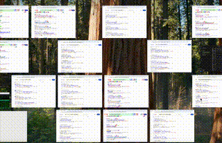
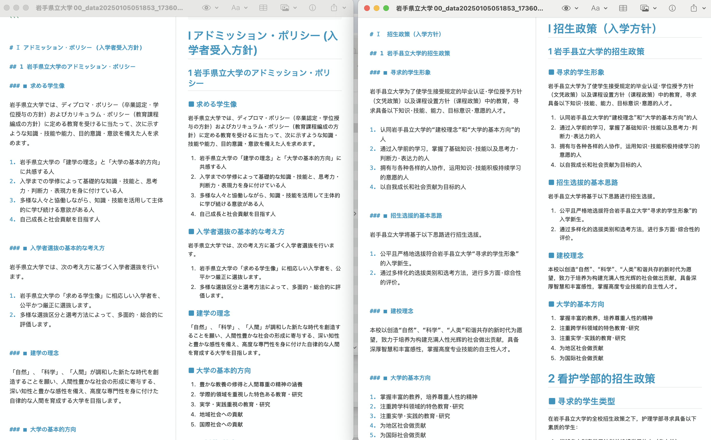

# NipponStudyKit 日本留学工具包

这个工具包是为了要去日本留学的孩子们写的，所谓工具包：这就是一堆小工具的集合，并不是什么大而全的东西。

我在做这个工具包的过程中，尽可能的使用包括LLM在内的各种时下流行的AI工具，是工具也是为了实践新的生产力。

## STEP1 get_admissions_handbooks

这个工具用于在互联网上抓取日本各所大学的招生信息（募集要项）。

日本的网站怎么说的，一言难尽，用过去传统的蜘蛛的做法可能不是什么容易的解决方案。于是我引用了名为[browser-use](https://github.com/browser-use/browser-use)的工具新贵（已经有9K的Star了）。

通过[Open-Router](https://openrouter.ai/)调用OpenAI的[Gpt-4o-mini](https://openrouter.ai/openai/gpt-4o-mini)来帮我甄别，哪些信息是我要的招生信息。

同时为了应对[browser-use](https://github.com/browser-use/browser-use)运行起来略迟缓的问题，我做了个简单的并发处理，来提升效率。

### 工具的使用
 - 一切之前，请你准备好[Open-Router](https://openrouter.ai/)的API KEY，还要完成充值
 - 首先，你需要按照[browser-use](https://github.com/browser-use/browser-use)的方法完成browser-use的安装
 - 其次，你还需要安装一些get_admissions_handbooks引用的依赖，因为这个Kit不是给小白用的，所以如果这一步不会的就不要自己动手了
 - 将.env.sample改名为.env，并把你的API KEY更新过去
 - 将eju_accepted_u_list.csv.sample改名为任意.csv文件，并将你感兴趣的学校的信息更新上去
 - 在运行之前，你还需要打开get_admissions_handbooks.py
  - 在代码的最下面，更新你自己的csv文件的名称
  - 根据你的内存情况更新并发的数量

## STEP 2 download_pdf.py

最没有技术含量的一步，基于第一步爬出来的PDF的URL，把这些PDF文件全部都下载下来。

### 工具的使用
 - 记得修改pdf_url_csv_path的路径

 本工具会自动检索指定的csv文件，并尝试下载每一行他找到的第一个URL。

 下载的结果会有一个Reprot，作为新的列加入到原有的csv中，并和下载下来的PDF放在一起（不会覆盖原有的CSV文件）。

## STEP 3 pdf2img

将下载的到的PDF全部分页转换为图片，这是我测试下来最好的OCR工作流，不要喂PDF（虽然PDF里面有文字，看上去能省事儿），而是干脆用视觉大模型来处理。

基于[convert2img](https://github.com/wengzhiwen/convert2img)项目进行修改。

这一步没有用什么AI，全靠本地CPU牛马，**尽可能使用多核CPU**。程序里内置了简单的多线程处理。

### 工具的使用
 - 记得修改pdf_folder的路径

本工具会将指定的目录下的所有PDF文件，分页打印到PNG文件（每页一个PNG）。

## STEP 4 img2md

将分页的图片，逐页做**OCR**，同时进行markdown的转化和翻译。效果如下图：

基于[img2md](https://github.com/wengzhiwen/img2md)项目进行修改。

这一步和第一步一样，借用了AI（这次是**Google Gemini**），也是金钱燃烧的一步。建议上一步选择DPI的时候选择100，视觉模型上能省点钱。

### 工具的使用
 - 建议去看原项目，主要就是要去Google Cloud把API认证用的JSON文件拿回来
 - 记得修改img_folder_base的路径

本工具会把img_folder_base下所有包含PNG文件的一级子目录，按目录为单位当作一个文档来进行处理。合成2个markdown文件（一个原版的、另一个是翻译件）。

**⚠️ AI的价格一直在变化，每个人的承受能力也不相同，建议给自己的账户设置好上限再开始测试**

